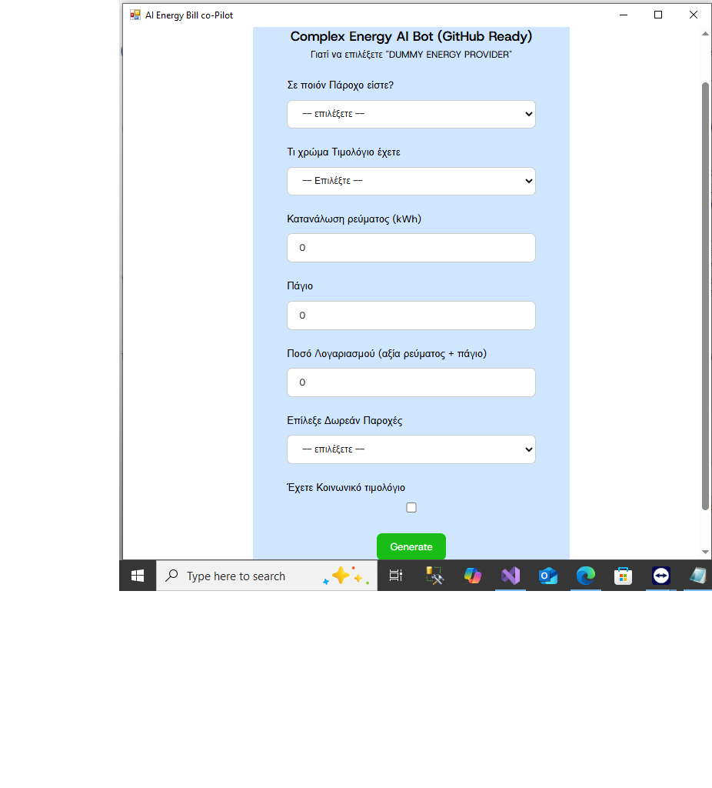

# ⚡ EnergyBill AI Copilot
AI Co-Pilot for Call Center Energy Price Assistance (WebView2-based)

A  Windows Forms app using WebView2 that embeds an AI bot to help energy providers explain billing and promote better offers.

## 🧠 Features

- Embedded AI co-pilot 
- Built with WebView2 (Edge-based)
- Instant answer generation for:
  - Current energy provider
  - Consumption
  - Offers from “Dummy Energy Provider”. Could be your provider!

---

## 🖼️ Screenshots

## 🚀 How to Use

1. Run `WebView2PlainTest.exe`
2. The embedded AI will help explain electricity bills
3. You can replace the URL in code with your own shared bot

---

## 🛠️ Tech Stack

- C#
- WebView2
- .NET Framework

---

## 🏷️ License

MIT License — free for commercial use with attribution.

---

**Made with 💡 by PC-Soft.gr**
